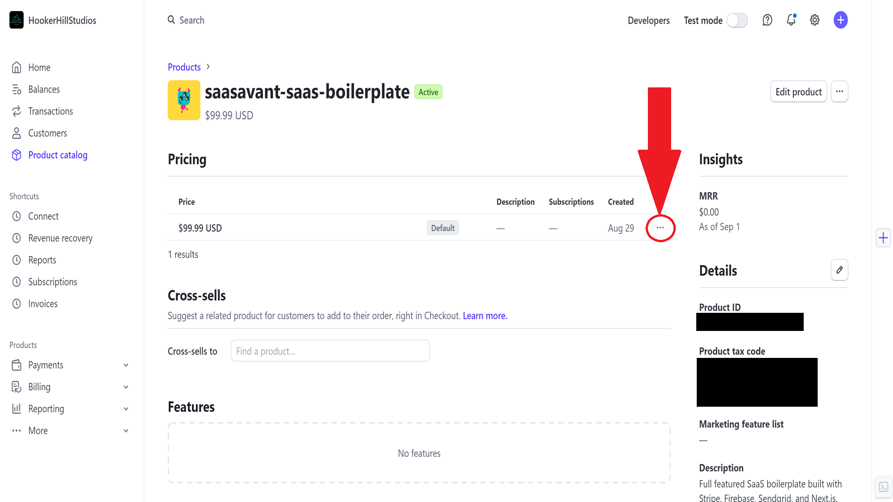
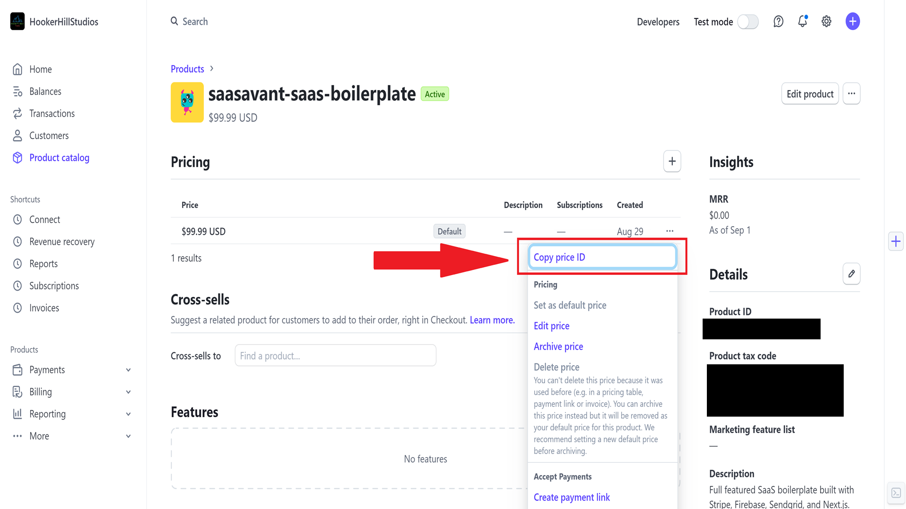

import { Callout } from "nextra-theme-docs";

# Adding Products to Stripe

Let's create a product in Stripe so that users can upgrade their accounts to become Premium Users.

<Callout emoji="📣"> **Important:** Do not add products before your extension is fully installed and the webhook is set up. Adding a product triggers the webhook, so if the installation isn't complete, your product might not appear until you update it. </Callout>

1. Create a New Product in Stripe

- Access the Stripe Dashboard.

- In the left-hand menu, click on `Product Catalog`.

- Click on the `Add Product` button in the top right corner of the page.

- Enter Product Details:

  1. Product Name: Give your product a name, such as "Monthly Plan" or "Yearly Plan".
  2. Description: Optionally, provide a brief description of the product.
  3. Image: Providing a thumnail image is recommended, it will be displayed in the product catalog and on the checkout page.

- Configure the Product:

  1. Set the correct price.

  2. Choose the type of charge (recurring, one-time, etc.).

  3. Configure any other options according to your needs.

The default subscription component in SaaSavant expects two products/prices, one for monthly and one for yearly. You can add additional products if you wish.

2. Add Stripe "priceIds" to Environment Variables

- Copy the Price ID:

  1. After creating your product, click on it to view its details. Then click on the three dots at far right of the page.

  

  2. In the popup menu, select `Copy Price ID`.

   
  
- Update Your `.env.local` File:

- Open the `.env.local` file in your project’s root directory.

- Paste the copied Price ID into the appropriate variable, for example:

```env
Copy code
NEXT_PUBLIC_MONTHLY_ID=your_monthly_price_id_here
NEXT_PUBLIC_YEARLY_ID=your_yearly_price_id_here
```

Replace `your_monthly_price_id_here` and `your_yearly_price_id_here` with the actual Price IDs you copied.

Save Your Changes:

Ensure you save the `.env.local` file after pasting in the Price IDs.
Repeat for Additional Products:

If you have multiple products, repeat the process to add each product&apos;s Price ID to the `.env.local` file.

---

You're all set! Your Stripe products are now configured, and the Price IDs are stored in your environment variables.