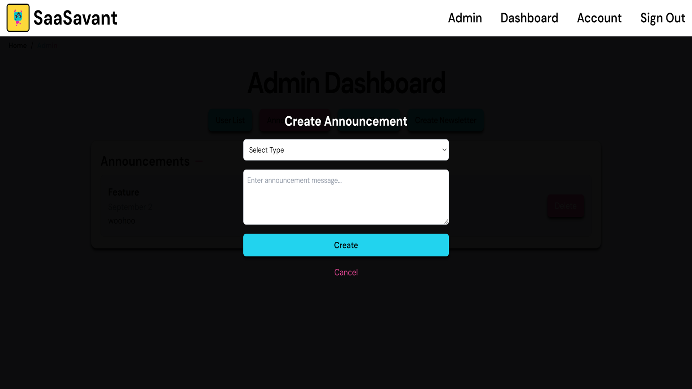

# Announcement Feature

## Functionality

- **Create and Publish Announcements** - Admins can create and publish announcements to be displayed to all users.

- **Pagination** - Display announcements in pages, with a limit of 5 announcements per page. Customize these values in the respective components file.

- **Broadcast Announcements** - Users will see the announcement on their dashboard the next time they log in. Once it has been dismissed by the user, it will no longer appear on their dashboard. If multiple announcements have been made since the last login, announcements will be displayed one at a time in order of creation. This ensures that users don't miss out on important announcements.

- **Delete Announcements** - Admins can delete announcements.