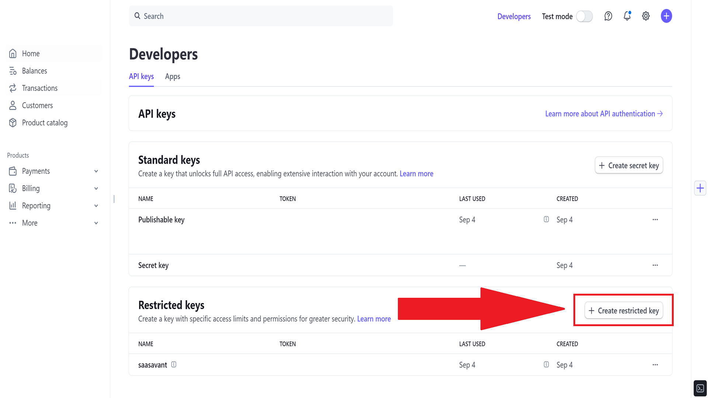
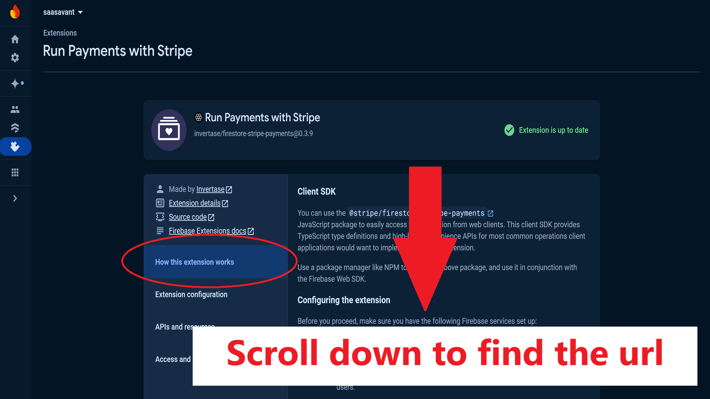
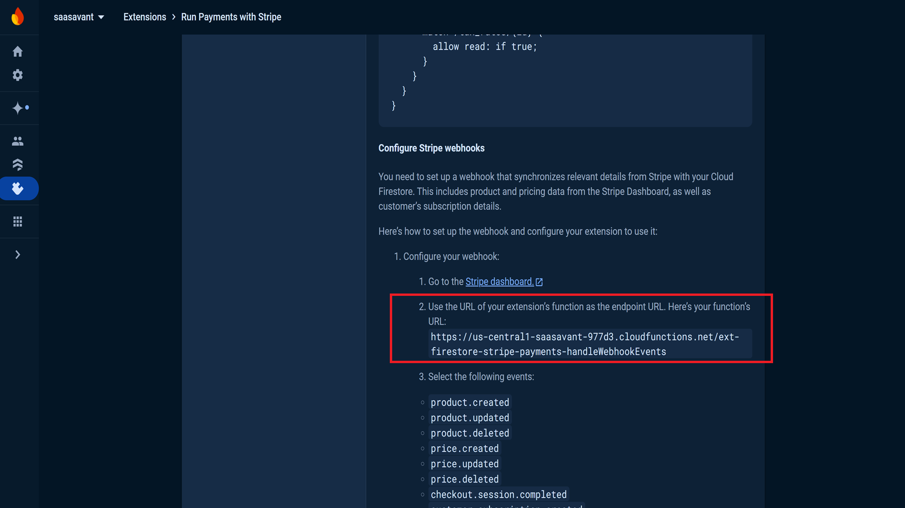

# Installing the "Run Payments with Stripe" Extension

Now that Firebase and Stripe are set up, you'll need to configure the "Run Payments with Stripe" extension in Firebase to handle various Stripe events, such as payment successes, subscription updates, and cancellations. Follow the steps below to ensure everything is set up correctly.

## Step 1: Configure the "Run Payments with Stripe" Extension

1. Go to your Firebase Console.
2. Navigate to `Extensions` and select the "Run Payments with Stripe" extension. There are two extensions with the same exact name, one made by Stripe and another made by Invertase. Oddly enough, the one we want is the one made by Invertase. Here is a direct link to the correct extension - [Run Payments With Stripe](https://extensions.dev/extensions/invertase/firestore-stripe-payments).

3. Click `Install`.

Follow the on-screen instructions to install the extension. At some point you will need to enable a billing account, do so and then continue to follow the on-screen instructions and enable the neccessary services when asked.

Click next (2 or three times) to be taken to the configuration form. I recommend the following settings, but you can change them as needed (e.g., if you want to use a different Cloud Functions deployment location). 

Leave the API keys blank for now and head back to the stripe dashboard. Click the `Developers` button in the top-right corner and open the `API Keys` section from the pop-up menu.

Generate a new `Restricted Key` with

- Write access to Customers
- Write access to Checkout Sessions
- Write access to Customer Portal
- Read access to Subscriptions

Once saved, copy the Restricted Key and put it in the Firebase Extension config in the "Stripe API Key with Restricted Access" field. Click "create key" to encrypt and save the key.

Click "Install" at the bottom. This process will take 3-5 minutes.

After it is done installing, copy the url from the "How this extension works" tab.

Go back to the Stripe Dashboard and click the `Developers` button in the top-right corner and open the `Webhooks` section from the pop-up menu.

Click `Create new endpoint` and copy the url from the "How this extension works" tab as the endpoint.

Select the following events to send to the endpoint:

- product.created
- product.updated
- product.deleted
- price.created
- price.updated
- price.deleted
- checkout.session.completed
- customer.subscription.created
- customer.subscription.updated
- customer.subscription.deleted
- tax_rate.created (optional)
- tax_rate.updated (optional)
- invoice.paid (optional, will sync invoices to Cloud Firestore)
- invoice.payment_succeeded (optional, will sync invoices to Cloud Firestore)
- invoice.payment_failed (optional, will sync invoices to Cloud Firestore)
- invoice.upcoming (optional, will sync invoices to Cloud Firestore)
- invoice.marked_uncollectible (optional, will sync invoices to Cloud Firestore)
- invoice.payment_action_required (optional, will sync invoices to Cloud Firestore)

Once the webhook is complete, copy the signing secret and place it in the `env.local` file of your project. 

Now, head to the Firebase dashboard and click the Extensions tab. Find your "Run Payments With Stripe" extension and click 'Reconfigure'. Paste the webhook signing secret into the "Stripe Webhook Secret" field.

Save the changes, this will take another 3-5 minutes. 
