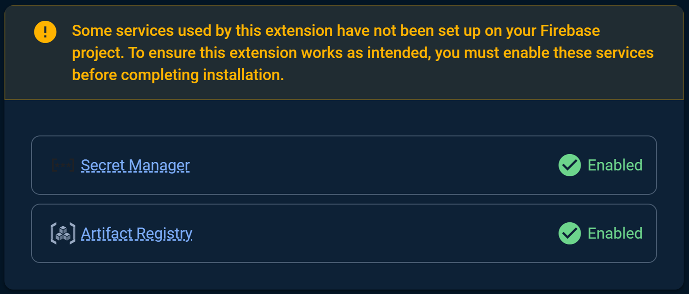
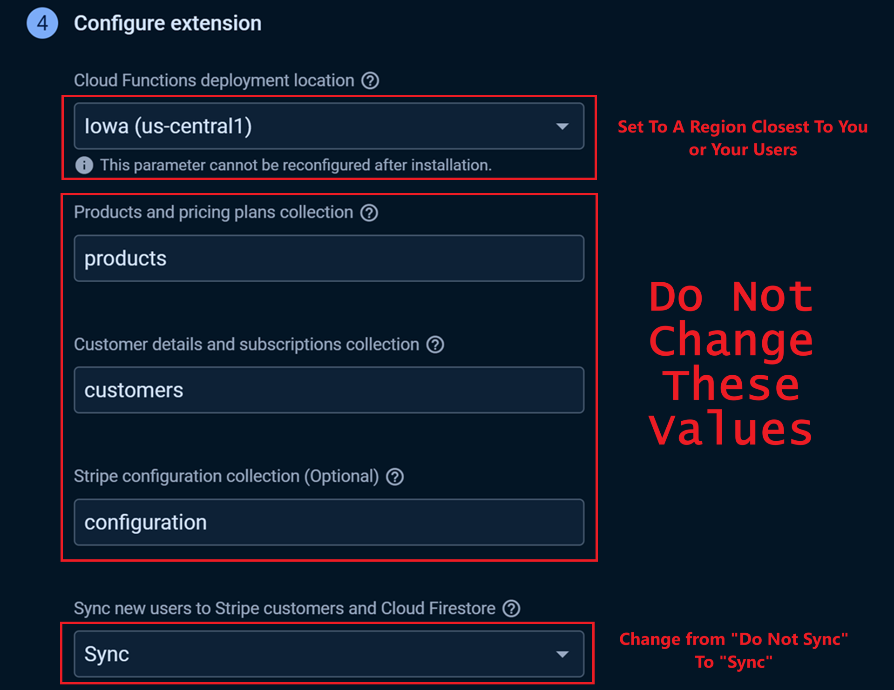
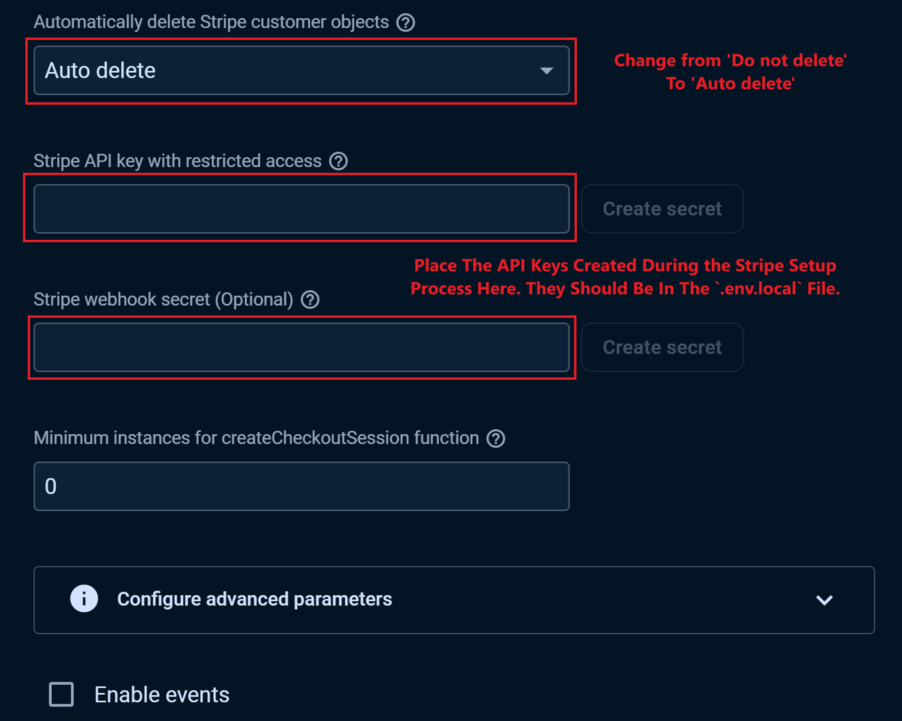
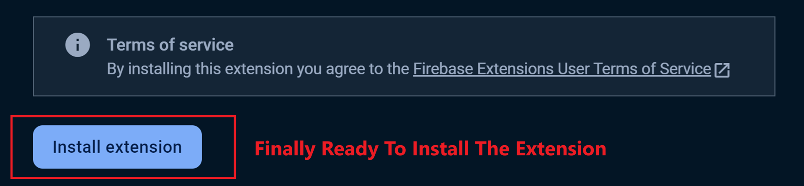

# Configuring the "Run Payments with Stripe" Extension

Once you've created a Stripe webhook, you'll need to configure the "Run Payments with Stripe" extension in Firebase to handle various Stripe events, such as payment successes, subscription updates, and cancellations. Follow the steps below to ensure everything is set up correctly.

## Step 1: Configure the "Run Payments with Stripe" Extension

1. Go to your Firebase Console.
2. Navigate to **Extensions** and select the "Run Payments with Stripe" extension.
3. Click 'Install'.

Follow the on-screen instructions to install the extension, You will need to enable a billing account, continue to follow the on-screen instructions and enable the two neccessary services:

Click next (2 or three times) to be taken to the configuration form. I recommend the following settings, but you can change them as needed (e.g., if you want to use a different Cloud Functions deployment location). Replace the API and webhook secrets with your own. They can be found in your .env.local file.

## Step 4: Test the Integration

Before going live, it's important to test the webhook to ensure everything is working correctly.

1. In your Stripe Dashboard, go to **Developers > Webhooks**.
2. Select your webhook and click **Send test webhook**.
3. Choose an event type (e.g., `checkout.session.completed`) and click **Send test webhook**.
4. Verify that the test event triggers the correct updates in your Firebase database.

## Step 5: Monitor and Troubleshoot

After deploying, keep an eye on both the Stripe Dashboard and Firebase Console to monitor for any issues.

- **Stripe Dashboard:** Check the logs under **Developers > Webhooks** to ensure events are being delivered successfully.
- **Firebase Console:** Monitor your Cloud Function logs to catch any errors or unexpected behavior.

## Conclusion

Your "Run Payments with Stripe" extension should now be fully configured and ready to handle Stripe events through your webhook. This setup allows you to automate payment processing and keep your Firebase database in sync with Stripe.

For more advanced configurations: 

- [Stripe documentation](https://stripe.com/docs/webhooks)

- [Firebase Extensions documentation](https://firebase.google.com/products/extensions).

