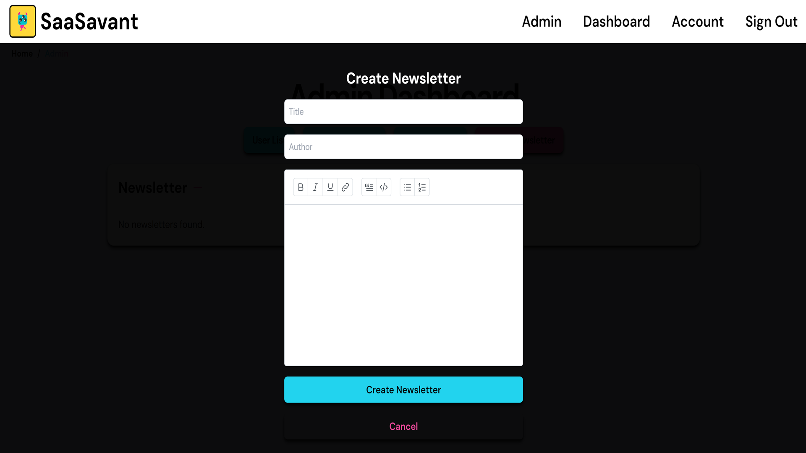

## Customizing Components

## Table of Contents

- [Introduction](#introduction)
- [Customizing Components](#customizing-components)
  - [Admin Dashboard](#admin-dashboard)
    - [Components List](#components-list-1)
  - [Landing Page](#landing-page)
    - [Components List](#components-list-2)

### Admin Dashboard

The Admin Dashboard is designed to help administrators manage various aspects of the application, including support tickets, announcements, newsletters, and user management. Each component within the dashboard is tailored to perform a specific task. This allows for easy customization of the text without needing to dive deep into the component logic.

#### Components List:

1. **`AdminDashboard.jsx`**
   - **Purpose:** Displays the main admin dashboard, serving as the central hub for all administrative activities.
   - **Functionality:** This component pulls together the different administrative features, providing an overview and access point for each section.

2. **`AdminTickets.jsx`**
   - **Purpose:** Manages and displays a paginated list of support tickets submitted by users.
   - **Functionality:** Admins can view and change the status of tickets (open or resolved). The `pageData` object at the top of the file allows easy customization of status labels, button texts, and other copy.

3. **`Announcements.jsx`**
   - **Purpose:** Displays and manages a list of announcements that admins can post to inform users.
   - **Functionality:** Announcements can be created or deleted by admins, with pagination support for managing a large number of posts. The `pageData` object lets admins easily modify announcement-related text, such as titles and button labels.

4. **`Newsletter.jsx`**
   - **Purpose:** Handles the creation and management of newsletters sent to subscribed users.
   - **Functionality:** Admins can create newsletters using a rich text editor, and delete them if necessary. The `pageData` object at the top enables easy changes to the text within the newsletter creation interface, making it simple to update instructions, labels, and messages.

   

5. **`UserList.jsx`**
   - **Purpose:** Manages and displays a paginated list of users in the system.
   - **Functionality:** Admins can create, delete, and promote/demote users. The `pageData` object allows for quick adjustments to user-related texts, such as role descriptions and action buttons.

   

### Landing Page

SaaSavant includes a custom fully-responsive landing page that showcases the product's value, features, and benefits. This page is designed to attract and convert visitors. It has been styled with tailwindcss and animated with Framer Motion to give a smooth and engaging experience.

Each component file includes a `pageData` object at the top, containing all the textual content. This approach simplifies the process of updating the landing page copy. Feel free to customize the landing page as needed.

To add or remove components from the page, open `page.tsx` located in the `App` folder.

#### Components List:

1. **`LandingPage.jsx`**
   - **Purpose:** Displays the main landing page, introducing users to the product.
   - **Functionality:** The page contains key sections like the hero, features, and testimonials, all of which can be customized through the `pageData` object.

2. **`CallToAction.tsx`**
   - **Purpose:** Encourages users to take a specific action, such as signing up or trying a demo.
   - **Functionality:** The call-to-action (CTA) section is designed to be compelling and easily customizable via the `pageData` object.

3. **`Feature.jsx`**
   - **Purpose:** Highlights an individual feature of the product, with a title, description, and icon.
   - **Functionality:** This component can be used multiple times within the `FeaturesSection` to showcase different features, with text and icons easily editable through the `pageData` object.

4. **`FeaturesSection.jsx`**
   - **Purpose:** Groups several `Feature` components together to present the main features of the product.
   - **Functionality:** The section is a key part of the landing page, and the `pageData` object makes it simple to adjust the content as needed.

5. **`Footer.tsx`**
   - **Purpose:** Displays the footer section with links, social media icons, and additional information.
   - **Functionality:** The footer is a persistent element across the site, with customizable content through the `pageData` object.

6. **`Header.tsx`**
   - **Purpose:** Displays the header section with navigation links and a logo.
   - **Functionality:** The header is crucial for site navigation and branding, and the `pageData` object allows for easy updates to the navigation links and other elements.

7. **`Hero.jsx`**
   - **Purpose:** Displays the hero section, typically the main headline and a prominent image or video.
   - **Functionality:** The hero section is designed to grab attention, with customizable text and media content through the `pageData` object.

8. **`LogoTicker.tsx`**
   - **Purpose:** Displays a scrolling ticker of logos, often used to show partners or featured clients.
   - **Functionality:** The ticker adds credibility by showcasing recognizable brands, with logos and related text managed via the `pageData` object.

9. **`PriceCard.jsx`**
   - **Purpose:** Displays pricing information in a card format, typically used in pricing sections.
   - **Functionality:** The `PriceCard` component presents different pricing plans, with text and pricing details easily customizable through the `pageData` object.

10. **`ProductShowcase.tsx`**
    - **Purpose:** Displays a showcase of the product, highlighting key aspects with images or videos.
    - **Functionality:** The showcase is a visual representation of the product’s strengths, with all text and media content manageable via the `pageData` object.

11. **`Testimonials.tsx`**
    - **Purpose:** Displays customer testimonials or reviews in a section to build trust and credibility.
    - **Functionality:** The testimonials are animated with Framer Motion to add dynamic appeal, with all text customizable through the `pageData` object.

