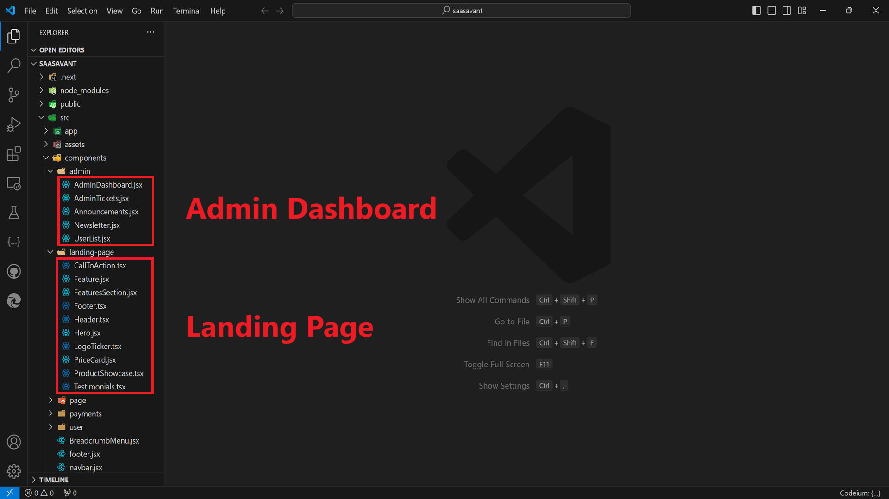

## Customizing Components

## Table of Contents

- [Introduction](#introduction)
- [Customizing Components](#customizing-components)
  - [Admin Dashboard](#admin-dashboard)
    - [Components List](#components-list-1)
  - [Landing Page](#landing-page)
    - [Components List](#components-list-2)

### Admin Dashboard

#### Components List:

1. `AdminDashboard.jsx`
- Displays the admin dashboard. Contains the following components:

2.` AdminTickets.jsx`
- Displays a paginated list of support tickets. Tickets can be marked as open or resolved by admins.

3. `Announcements.jsx`
- Displays a paginated list of announcements. Announcements can be created or deleted by admins.

4. `Newsletter.jsx`
- Displays a paginated list of newsletters. Newsletters can be created or deleted by admins using a rich text editor. Newsletters are sent to subscribed users after creation.

5. `UserList.jsx`
- Displays a paginated list of users. Users can be created, deleted, and promoted/demoted by admins.

### Landing Page

#### Components List

1. `LandingPage.jsx`
   - Displays the landing page. Contains the following components:

2. `CallToAction.tsx`
   - A component that displays a call-to-action section, encouraging users to take a specific action.

3. `Feature.jsx`
   - Displays an individual feature with a title, description, and icon.

4. `FeaturesSection.jsx`
   - Groups several `Feature` components together to showcase the product’s main features.

5. `Footer.tsx`
   - Displays the footer section with links, social media icons, and additional information.

6. `Header.tsx`
   - Displays the header section with navigation links and a logo.

7. `Hero.jsx`
   - Displays the hero section, typically the main headline and a prominent image or video.

8. `LogoTicker.tsx`
   - Displays a scrolling ticker of logos, often used to show partners or featured clients.

9. `PriceCard.jsx`
   - Displays pricing information in a card format, typically used in pricing sections.

10. `ProductShowcase.tsx`
    - Displays a showcase of the product, highlighting key aspects with images or videos.

11. `Testimonials.tsx`
    - Displays customer testimonials or reviews in a section to build trust and credibility. Animated with Framer Motion.

