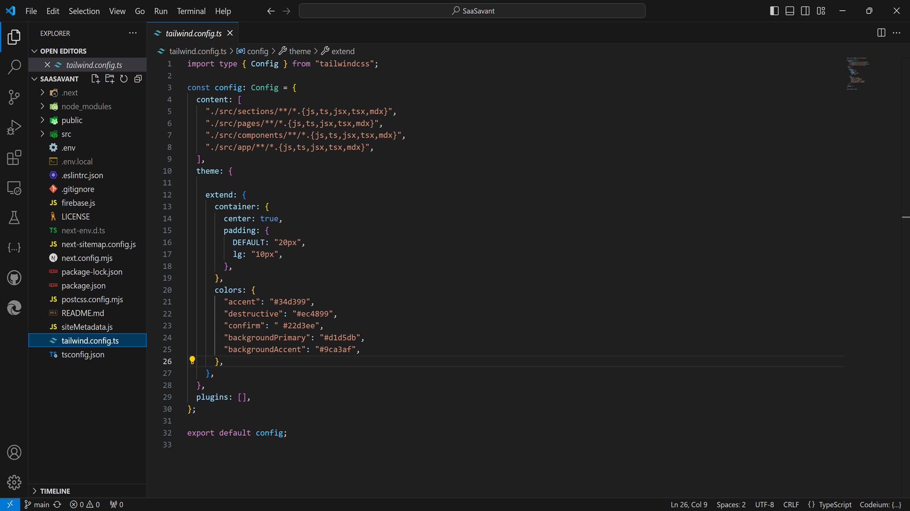

## Customizing the Theme

The theme in SaaSavant is built with [Tailwind CSS](https://tailwindcss.com/). You can customize the theme in `tailwind.config.js` in the root directory of your project.

Change the `confirm` and `destructive` color values to match your brand. The blue and pink color seen on the landing page and throughout the app are the defaults based on these two values.

