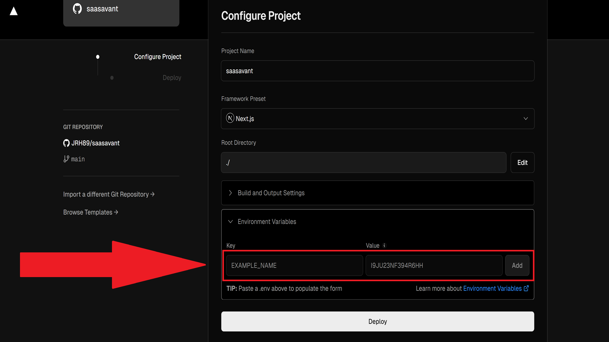
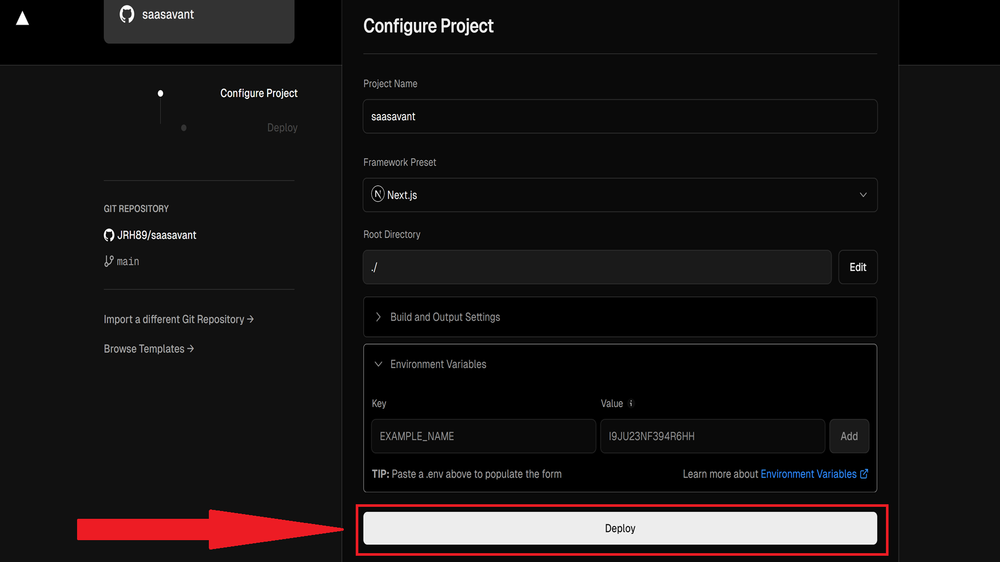
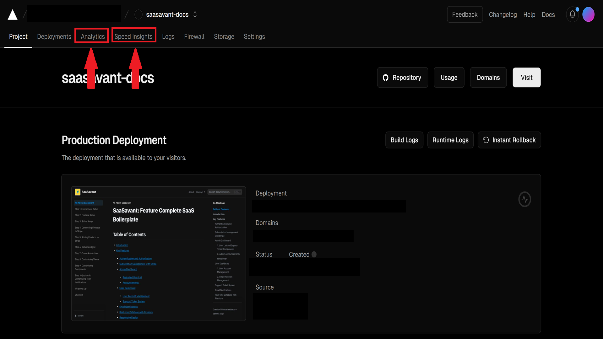

# Deploying Your SaaSavant Boilerplate SaaS Project to Vercel

In this guide, you'll learn how to deploy the **SaaSavant** project to **Vercel**, ensuring all necessary configuration for smooth deployment.

## Prerequisites

Before proceeding with deployment, make sure you have the following:

- A **Vercel** account (You can sign up at [Vercel](https://vercel.com/)).
- The **SaaSavant** project is up and running locally.
- All necessary environment variables set up.

---

## Step 1: Push the Code to a Git Repository

Vercel automatically deploys from Git repositories (GitHub, GitLab, or Bitbucket). Ensure your project code is pushed to a repository.

1. Initialize a git repository (if not done yet):
   ```bash
   git init
   ```

2. Add your project code to the repository:
   ```bash
   git add .
   ```

3. Commit your changes:
   ```bash
   git commit -m "Initial commit"
   ```

4. Push your changes to the remote repository:

Replace `your-username` and `repo-name` with your GitHub username and repository name.

```bash
git remote add origin https://github.com/your-username/repo-name.git
git push -u origin main
```

## Step 2: Connect to Vercel

1. Go to [Vercel's dashboard](https://vercel.com/dashboard) and log in.
2. Click `Add New Project`.
3. Choose the Git repository where SaaSavant is located.
4. Click Import next to your repository.
5. Enter environment variables.



6. Click `Deploy`.



7. Enable Speed Insights and Analytics in the Vercel dashboard.

The code has been configured for collecting analytics and speed insights, but in order for it to work you must enable these features in the Vercel dashboard.


