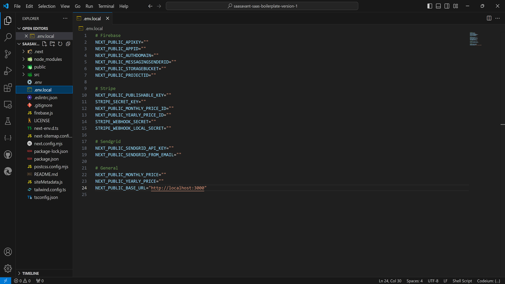
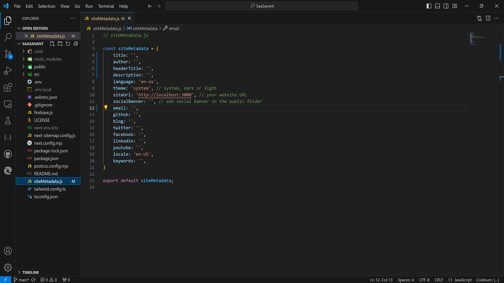
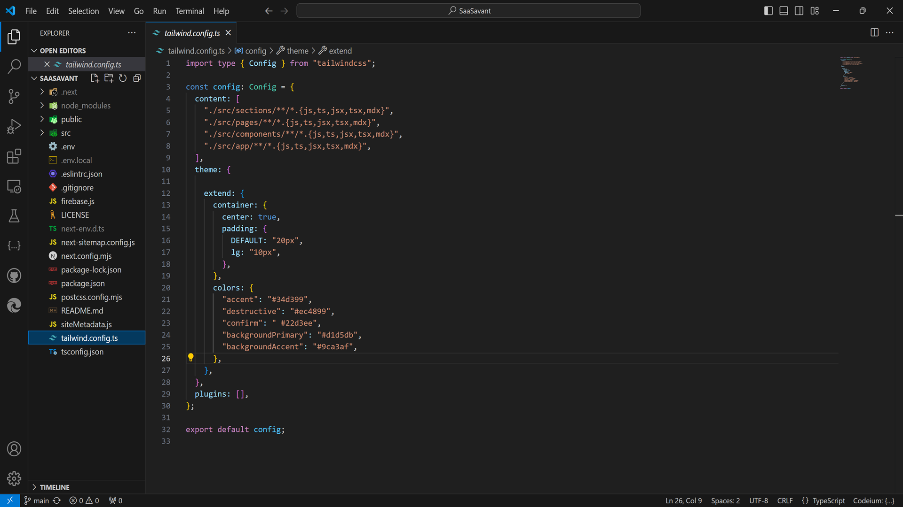
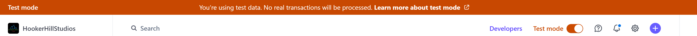

import { Callout } from "nextra-theme-docs";

# Final Steps

Let's wrap up by completing our `.env.local`, `siteMetadata.js`, and `tailwind.config.js` files.

- Environment Variables


- Site Metadata


- Edit Theme


## Next Steps

1. Confirm Completion of Guide Steps:

- Ensure you have followed all steps outlined in this guide.
- Verify that you have successfully set up Firebase, Stripe, and SendGrid projects.

2. Check Configuration Files:

- Your `.env.local` and `siteMetadata.js` files should be correctly configured and in place.

3. Set Up Development Environment:

- Run `yarn dev` or `npm run dev` from the terminal in the root directory of your project to start the development server.

4. Test Payment Integration:

- If you are using Stripe's Development Mode API Keys (recommended for development and testing), use a 'test' credit card to simulate a payment and ensure successful subscription creation. For more details, refer to the [Stripe testing documentation](https://stripe.com/docs/testing#cards).
- Obtain development keys from [Stripe Dashboard](https://dashboard.stripe.com/test/apikeys).
- Once testing is complete, replace the keys in the `.env.local` file with your live keys and turn off Development Mode in the Stripe Dashboard.

3. Sample Firestore Rules for Production

In a production environment, it's crucial to ensure that your Firestore rules protect sensitive data while allowing the necessary access. Here's a sample Firestore rule set that allows anyone to read documents but only authenticated users can write or delete:

```json
rules_version = '2';
service cloud.firestore {
  match /databases/{database}/documents {
    // Allow anyone to read any document
    match /{document=**} {
      allow read: if true;

      // Allow authenticated users to write or delete documents
      allow write, delete: if request.auth != null;
    }
  }
}
```

### Explanation:
- **'allow read: if true;'** - This rule allows anyone to read data from your Firestore database.
- **'allow write, delete: if request.auth != null;'** - This rule allows only authenticated users to write or delete documents. **'request.auth'** is used to check if the user is authenticated.

### Additional Recommendations:

- **Limit Write Access**: Adjust the rules based on the specific collections and documents where write access is necessary. For example, you might want to restrict write access to only certain users or roles.
- **Testing**: Before deploying the rules, test them thoroughly to ensure they meet your security and access requirements.

By following these steps and using the sample rules, you can ensure that your application is both functional and secure for production use.

## **Congrats**

Your project should be setup and ready for development. Run `yarn dev` or `npm run  dev` from the terminal in the root directory of your project to start the development server.

If you are using Stripe Development Mode API Keys (recommended while developing and testing), you can use a 'test' credit card to mock a payment and ensure successful subscription creation. See the [Stripe docs](https://stripe.com/docs/testing#cards) for more details. To get the development keys, head to https://dashboard.stripe.com/test/apikeys

When you are done testing, replace the keys in the `.env.local` file with your live keys and turn off the development mode in the Stripe Dashboard.


