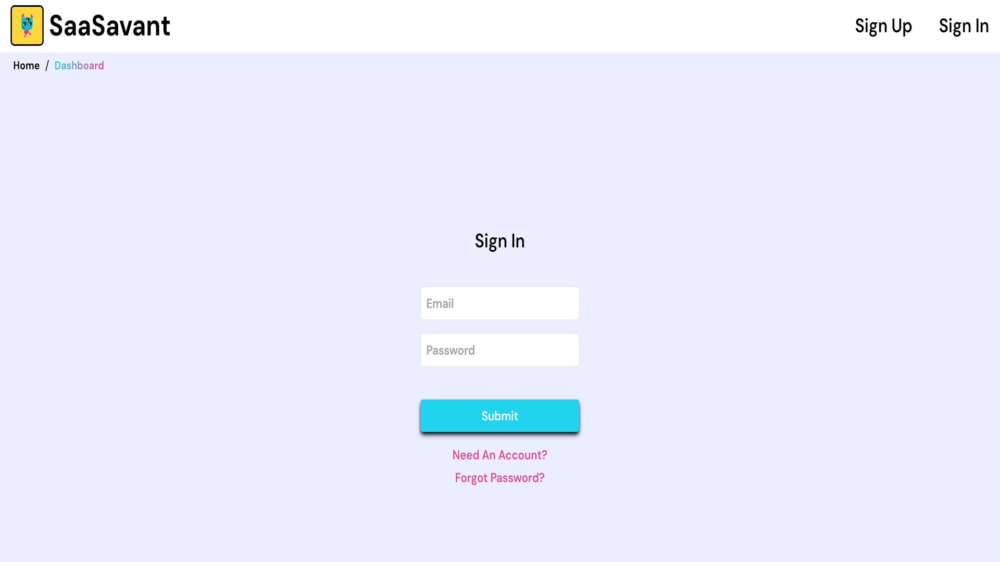
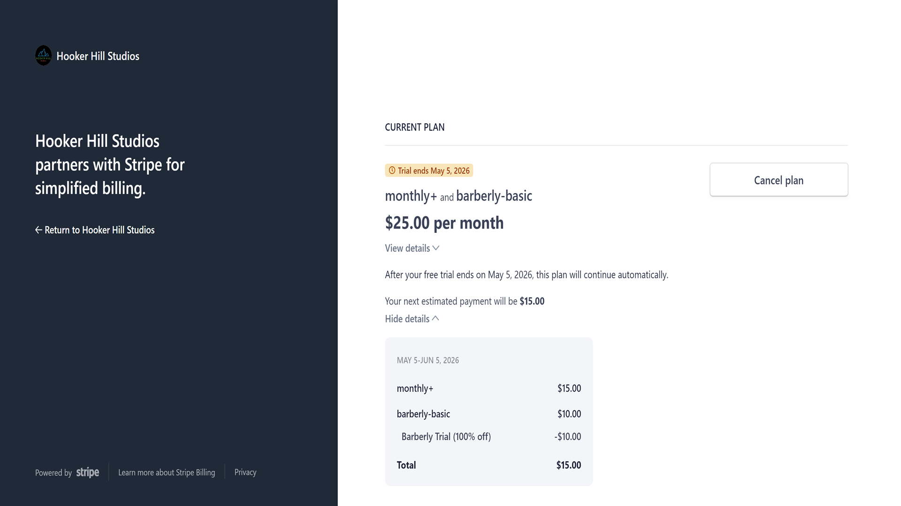
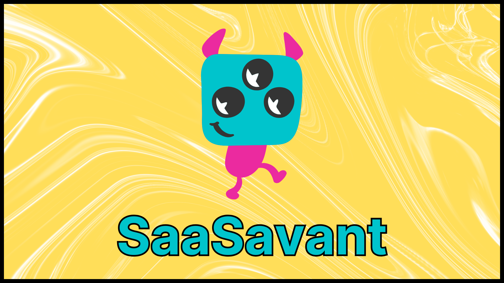

# SaaSavant: The Ultimate SaaS Boilerplate

## Table of Contents

- [Introduction](#introduction)
- [Key Features](#key-features)
  - [Authentication and Authorization](#authentication-and-authorization)
  - [Subscription Management with Stripe](#subscription-management-with-stripe)
  - [Admin Dashboard](#admin-dashboard)
    - [Paginated User List](#paginated-user-list)
    - [Announcements](#announcements)
  - [User Dashboard](#user-dashboard)
    - [User Account Management](#user-account-management)
    - [Support Ticket System](#support-ticket-system)
  - [Email Notifications](#email-notifications)
  - [Real-time Database with Firestore](#real-time-database-with-firestore)
  - [Responsive Design](#responsive-design)
- [Technology Stack](#technology-stack)
  - [Frontend](#frontend)
  - [Backend](#backend)
  - [Payments](#payments)
  - [Email Service](#email-service)
  - [Hosting and Deployment](#hosting-and-deployment)
  - [Version Control](#version-control)
- [Getting Started with SaaSavant](#getting-started-with-saasavant)
- [Conclusion](#conclusion)

## Introduction

SaaSavant is a robust and feature-rich SaaS boilerplate designed to accelerate your software-as-a-service project. Built with the latest technologies and best practices, SaaSavant provides a strong foundation for any SaaS application, whether you're building a simple tool or a complex platform.

## Key Features

### Authentication and Authorization

SaaSavant includes a secure and scalable authentication system powered by Firebase Authentication. It supports a preconfigured sign-in flow using email and password.

Other authentication methods, such as Google, Facebook, and GitHub, can be added as well by enabling them from the Firebase dashboard.

Additionally, role-based authorization ensures that users have access only to the parts of the application they need.

### Subscription Management with Stripe

SaaSavant integrates seamlessly with Stripe to handle subscription payments. The boilerplate includes:

- Subscription plans: Create and manage multiple subscription tiers.
- Automatic billing: Charge customers on a recurring basis.
- Webhooks: Listen for and handle events such as successful payments, subscription cancellations, and failed payments.
- Account Management: Allow users of your SaaS application to manage their subscription details.

### Admin Dashboard

The admin dashboard in SaaSavant provides a comprehensive interface for managing your application. Key features include:

#### Paginated User List

- **User Management**: View and manage all registered users.
- **Pagination**: Display users in pages, with a limit of 50 users per page and scrolling after the first 10 for ease of navigation. These values are customizable, more on that later.

#### Announcements

- **Create Announcements**: Admins can create and publish announcements to be displayed to all users.

### User Dashboard

Each user has access to a personalized dashboard where they can:

- **View Subscription Details**: Access information about their current subscription and manage billing.
- **Upgrade Subscription**: Easily upgrade to a premium plan directly from their dashboard.
- **Submit or Access Support Tickets**: View their submitted support tickets and track their status.

#### User Account Management

- **Upgrade to Premium**: Users can upgrade their subscription plan if they haven't already.
- **Manage Account**: Subscribed users can manage their subscription details.
- **Reset Password**: Users can easily reset their password if they forget it.
- **Delete Account**: Users have the option to delete their account if they choose to leave the service.

**Stripe Account Management**

- Users can manage their Stripe account details and subscriptions.
- SaaSavant is preconfigured to autogenerate a Stripe URL for each user when they subscribe. This URL can be used to manage their Stripe account. 
- Clicking the "Manage Subscription" button from their user account page will take them straight to their Stripe account using this Stripe URL.

### Support Ticket System

SaaSavant features a built-in support ticket system that allows users to:

- **Submit Tickets**: Users can submit support tickets from their dashboard, including details and attachments if needed.

- **Track Status**: View the status of their tickets, which are initially marked as 'submitted' and can be updated to 'open' or 'resolved' by admins.

- **Admin Management**: Admins can view, respond to, and manage all support tickets from their dashboard.

### Email Notifications

SaaSavant integrates with SendGrid to send email notifications for various events. Sample use cases include:

- Welcome emails upon registration (pre-configured)
- Support ticket updates
- App update notifications

### Real-time Database with Firestore

Firestore serves as the primary database for SaaSavant, providing real-time data synchronization and offline support. Key use cases include:

- Storing user profiles and subscription data
- Managing support tickets
- Logging user activities and interactions

### Responsive Design

SaaSavant is built with a mobile-first approach, ensuring that your application looks great and functions seamlessly across all devices, from desktops to smartphones.

## Technology Stack

### Frontend

- **Next.js**: For server-side rendering, static site generation, and overall performance.
- **React**: The core library for building the user interface.
- **Tailwind CSS**: A utility-first CSS framework for fast and responsive UI development.
- **Framer Motion**: For adding smooth animations and interactions to the UI.
- **React Toastify**: For displaying toast notifications.

### Backend

- **Firebase Authentication**: For secure and scalable user authentication.
- **Firebase Firestore**: A real-time NoSQL database for storing user data, subscriptions, and tickets.
- **Firebase Cloud Functions**: To handle server-side logic, such as processing Stripe webhooks.

### Payments

- **Stripe**: For handling subscription payments, including recurring billing and webhooks.

### Email Service

- **SendGrid**: For sending transactional emails, such as registration confirmations and payment receipts.

### Hosting and Deployment

- **Vercel**: SaaSavant is designed to be hosted on Vercel, providing fast and reliable deployment with global CDN and automatic SSL, however you can choose to host it wherever Next.js apps are supported.

## Conclusion

SaaSavant is designed to save you time and effort, allowing you to focus on building the core functionality of your SaaS product. With its comprehensive feature set and modern technology stack, SaaSavant is the ideal starting point for your next SaaS application.

