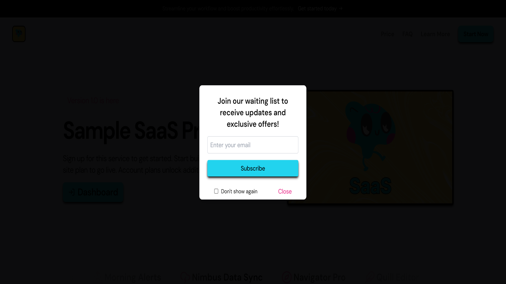

# Lead Capture Form: Generate Leads Before Launch

The lead capture form in SaaSavant is a key feature designed to help you build your email list and generate leads even before your product is fully launched. This pre-made form is integrated into your landing page and provides an easy way for visitors to express their interest in your offering.

## Key Features

- **Automatic Popup:** The form automatically appears on your landing page 10 seconds after a visitor arrives. This delay gives users time to engage with your content before being prompted to sign up.
  
- **Simple Email Submission:** Visitors can enter their email address directly into the form. This submission will add their email to the `waitingList` collection in Firebase Firestore, allowing you to collect and manage potential leads efficiently.

- **Customizable Options:** If you wish to customize the form or remove it entirely, you can do so by modifying or removing the component in your `app/page.tsx` file. This flexibility ensures the form aligns with your branding and user experience goals.

## Benefits

### **Generate Leads Early**

The lead capture form allows you to start building a list of interested prospects even before your product launches. By capturing email addresses, you can:

- **Engage Early Adopters:** Reach out to potential customers who are already interested in your product or service. Early engagement can lead to a more successful launch.

- **Build Anticipation:** Keep your audience informed and excited about upcoming features, updates, and launch dates. Regular communication can help maintain interest and increase the likelihood of conversions.

- **Gather Feedback:** Use the early feedback from potential users to refine your product and address any concerns before the official launch.

### **Manage and Use Your Waiting List**

Once you have collected email addresses, you can:

- **Send Updates and Offers:** Use the collected email addresses to send out newsletters, exclusive offers, and updates about your product. This helps in maintaining engagement and building relationships with your audience.

- **Analyze Interest:** Understand how many visitors are interested in your product by tracking sign-ups. This data can be valuable for planning your marketing strategy and making informed decisions.

## Customization and Management

If you need to customize the form or remove it from your landing page, you can easily do so by editing the `app/page.tsx` file. This flexibility allows you to:

- **Adjust Appearance:** Modify the styling and content of the form to better fit your brand’s aesthetics.
  
- **Enable/Disable:** Choose to display or hide the form based on your needs. If you decide to remove it, simply update the `app/page.tsx` file to fit your preferences.

By leveraging the lead capture form, you can start generating leads and building a strong foundation for your product’s launch. This pre-made feature is designed to help you connect with potential customers and enhance your marketing efforts from day one.

