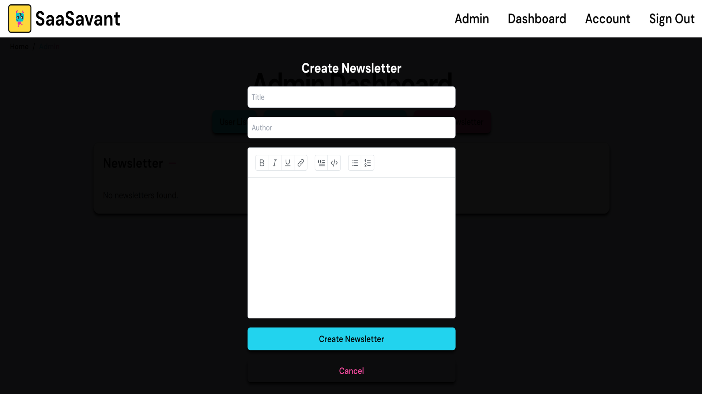

# Newsletter Feature

## Functionality

- **Create and Publish Newsletters** - Admins can create and publish newsletters using a rich text editor. Newsletters are sent to all users after creation via Sendgrid.

- **Pagination** - Display newsletters in pages, with a limit of 1 newsletter per page. Customize these values in the respective components file.

- **Delete Newsletters** - Admins can delete newsletters.