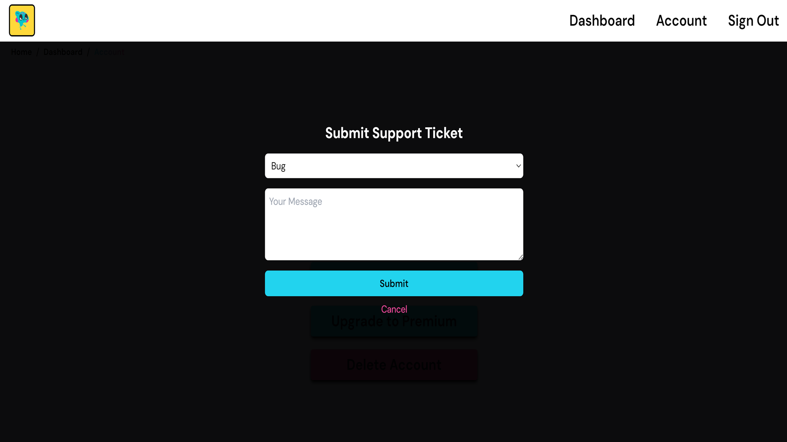

# Support Ticket System

## Functionality

- **Submit Tickets**: Users can submit support tickets from their dashboard, including details and attachments if needed.

- **Track Status**: View the status of their tickets, which are initially marked as 'submitted' and can be updated to 'open' or 'resolved' by admins.

- **Admin Management**: Admins can view, respond to, and manage all support tickets from their dashboard.

- **Pagination**: Displays support tickets in pages, for ease of navigation.
