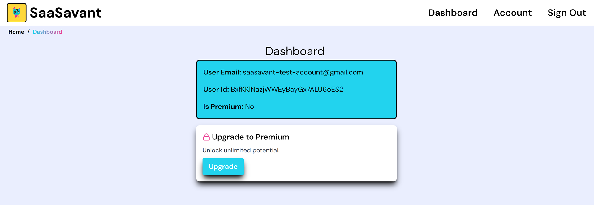

import { Callout } from "nextra-theme-docs";

# Wrapping Up

Let's wrap up real quick by finishing up our .env file.

---

### **Site URL and Functions URL**

The Nextjs project utilizes server side api calls, this means we need a fully qualified URL to hit our own API.

To solve the we have this env variable:

```sh
# Config
NEXT_PUBLIC_BASE_URL=""
```

Since we have not set this env variable yet, it will fallback to http://localhost:3000 for development purposes.

When deploying, you should update it to the deployed url of your project, for example:

If your url is https://saasavant.vercel.app

Your env var would look like this

```sh
NEXT_PUBLIC_BASE_URL="http://saasavant.vercel.app"
```

### **Congrats**

Your project should be setup and ready for development. Run `yarn dev` or `npm run  dev` from the terminal in the root directory of your porject to start the development server.

Head to http://localhost:3000/Signup to create a test account.

Check out the [user dashboard](http://localhost:3000/Dashboard), it should display your user email address, user ID, and subscription status.



If you are using Stripe Development Mode API Keys (recommended while developing and testing), you can use a 'test' credit card to mock a payment and ensure successful subscription creation. See the [Stripe docs](https://stripe.com/docs/testing#cards) for more details.

To get the development keys, head to https://dashboard.stripe.com/test/apikeys

When you are done testing, replace the keys in the .env file with your live keys and turn off the development mode in the Stripe Dashboard.


